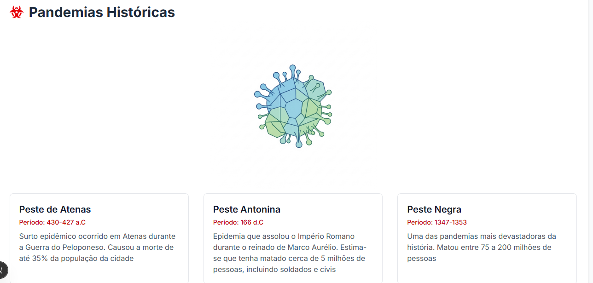
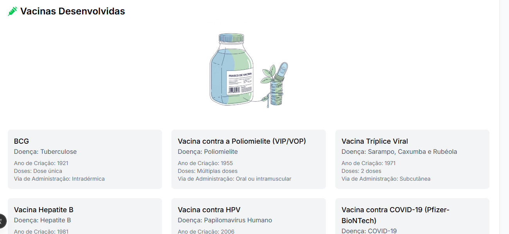
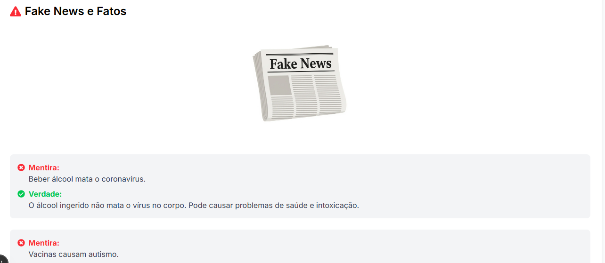

# 🧬 DataVírus

Este projeto é uma **landing page interativa e informativa**, desenvolvida como parte de um miniprojeto. O objetivo é apresentar dados sobre **pandemias históricas**, **vacinas** e **desmistificar fake news** relacionadas à saúde — tudo isso consumindo dados de uma **API externa**.

---

## 📸 Imagens do Projeto

> 💡 *Sugestão:* Experimente o site e visualize melhor

### Seção de Pandemias



### Seção de Vacinas



### Seção de Fake News



---

## 🚀 Contextualização

Em um mundo onde a **informação (e a desinformação)** viaja na velocidade da luz, ter fontes confiáveis e bem apresentadas é crucial.  
Esta página foi criada para **centralizar informações relevantes** sobre três temas interligados e fundamentais para a saúde pública:

- **🦠 Pandemias Históricas**: Uma visão sobre as grandes pandemias que moldaram nosso mundo.
- **💉 Vacinas**: Informações claras sobre as vacinas desenvolvidas para combater essas doenças.
- **📰 Fake News**: Correção de notícias falsas com dados verificados e base científica.

O layout é **responsivo**, **moderno** e focado na **experiência do usuário**, garantindo clareza, acessibilidade e usabilidade.

---

## 🛠️ Tecnologias Utilizadas

| Tecnologia       | Versão   | Descrição                                                                 |
|------------------|----------|---------------------------------------------------------------------------|
| [Next.js](https://nextjs.org)         | 14.2.3   | Framework React com renderização híbrida e otimizações automáticas.      |
| [React](https://reactjs.org)          | 18.3.1   | Biblioteca para construção de interfaces de usuário.                     |
| [TypeScript](https://www.typescriptlang.org)     | 5.4.5   | Superset do JavaScript com tipagem estática.                             |
| [Tailwind CSS](https://tailwindcss.com)      | 3.4.3   | Framework CSS utility-first para estilização rápida e responsiva.        |
| [React Icons](https://react-icons.github.io/react-icons)  | 5.2.1   | Biblioteca de ícones populares para React.                               |

> 🔍 *Observação:* As versões foram consultadas no arquivo `package.json` do projeto.

---

## ⚙️ Executando o Projeto Localmente

Para rodar este projeto na sua máquina, você precisa ter o **Node.js (v18+)** e o **Git** instalados.

### 1. Clone o repositório do front-end 

```bash
git clone https://github.com/Sam02marques/Landing_Page_Pandemias.git
```
### 2. Entre no diretório do projeto
```bash
cd Landing_Page_Pandemias
```
### 3. Instale as dependências do projeto

```bash
npm install
```
### 4. Inicie o projeto

```bash
npm run dev
```
### 5. Acesse a aplicação no terminal
```bash
No terminal acesse:
👉 http://localhost:3000
```

## Repositório da API

Toda a informação exibida na página é fornecida por uma API externa.
Você pode acessar o repositório da API no link abaixo:

📦 Repositório da API: https://github.com/Sam02marques/pandemia-API

## Contribuições Futuras

Contribuições são muito bem aceitas! Se você deseja contribuir com este projeto, por favor:

1. Faça um fork do repositório
2. Crie uma branch para sua feature (git checkout -b feature/nova-feature)
3. Faça commit das suas alterações (git commit -m 'Adiciona nova feature')
4. Faça push para a branch (git push origin feature/nova-feature)
5. Abra um Pull Request

## Autor

**Sam Marques**
- LinkedIn: [Meu LinkedIn](https://www.linkedin.com/in/samuel-marques-90b818284/)
